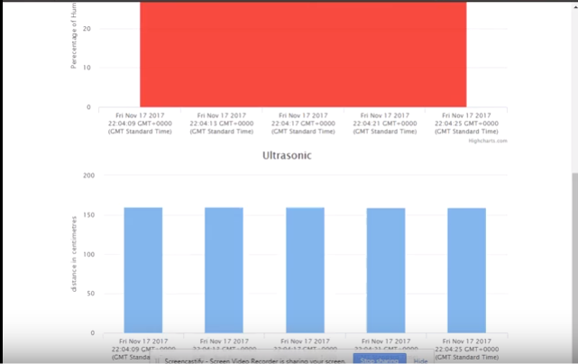

# GrovePi-Project
My first experience using python. Using RaspberryPI, GrovePi and dweet.io 

This projects works by taking readings from 3 sensor readings(Humidity, temperature and ultrasonic) from the grove pi
and displaying the readings on 3 multiple graphs.

Using Dweet.io I was able to push the readings to a html file and show the readings.
By using Sqlite 3 I was able to store reading a number of readings to a local database

The configurationfile contains the dweet.io thing name used in this project.

From the first screenshot you can see a rise in both the temperature and humidity as my hand holds onto the sensor.

